- ソフトウェアのモデリング
    - 何をさせたいか(what)の「要求定義、要求モデリング」と、どう作るか(how)の「設計」の段階に分けられる

- 要求モデリングは「機能モデリング」と「データモデリング」に分けられる
    - 機能モデリング
        - コンピュータに任せる仕事を整理する

    - データモデリング
        - コンピュータに覚えさせる情報を整理する
        - 管理したい情報の性質を定義し、適切な名前をつけて概念を明確にする作業
        - 「概念モデリング」とも呼ばれる

- 概念モデリングを行うことの効果
    - システムの全体像を把握できる
        - アプリケーションの機能や規模や複雑さを把握できる
    - 対象とするビジネス活動そのものを理解できる
        - ビジネス上の出来事や登場人物がもれなく反映されるから

- UML(Unified Modeling Language)の中心となるもの
    - クラス図
    - オブジェクト図
    - ステートマシン図

- 概念モデリングの基本要素
    - クラス
    - 属性
    - 関連
    - 継承

- クラス
    - UMLでは「集合」を指す
    - 会員顧客クラスが集合で、個々の顧客が集合の要素(インスタンス)
    - 表現したい対象を集合として定義し、そこに適切な名前をつける

- 属性
    - 集合の要素が共通で持つ性質
    - 会員顧客は名称とメールアドレスを持つ

- 概念モデリングで表現するものは全て情報のため、クラス名には情報はつけない

---
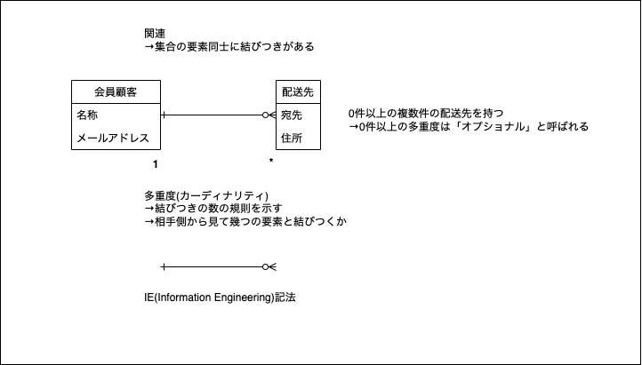

---

- 実際には同じものでも、情報の重複を許容できる場合は別のインスタンスとして表現する

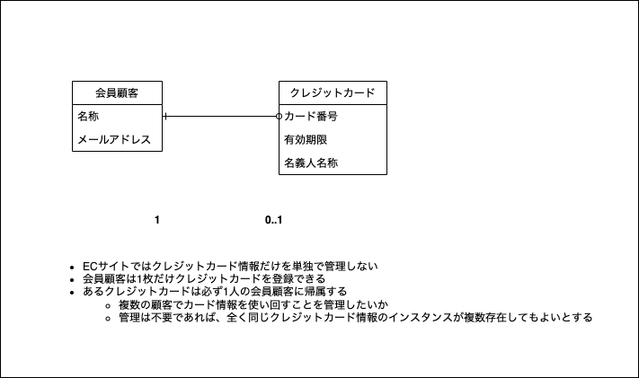

---

- 概念モデリングにおける継承は全体集合と部分集合の関係を表現するために使う

- サブクラス間で同じインスタンスは共有できない（部分集合の積集合には要素が存在しない)

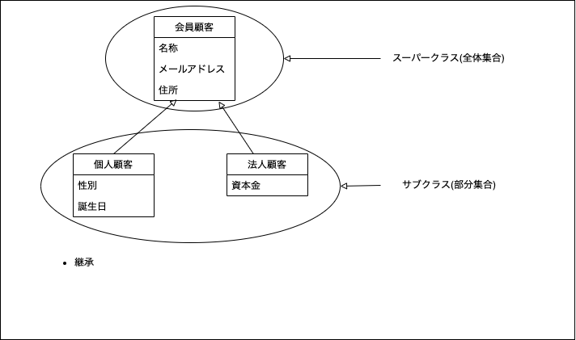

---

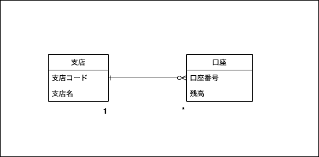
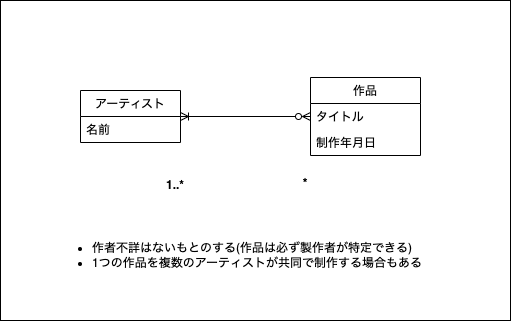

---
- 協力会社や顧客企業は取引先として一元管理する

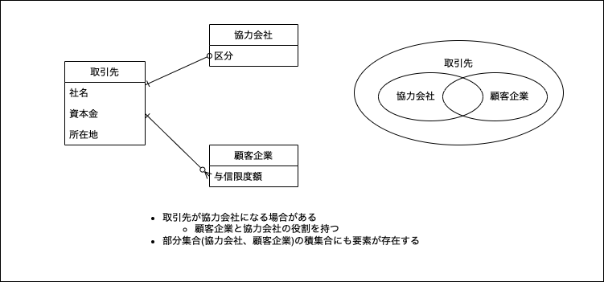

---
- 協力会社や顧客企業は取引先として一元管理する

- 部分集合の積集合に要素が存在する場合 = 1つの実体が複数の役割を持つことができる
    - 部分集合固有の性質を役割として実体から分離して表現できる

---
- 時間の経過により要素の属する部分集合が変わる場合は、変化する部分を役割として実体から切り出す

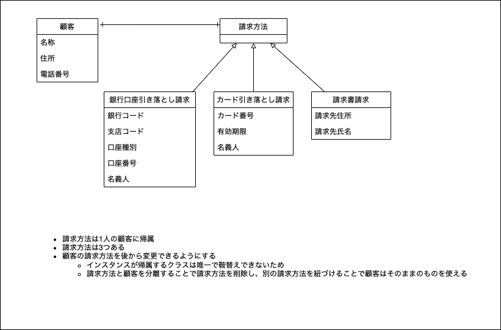

---
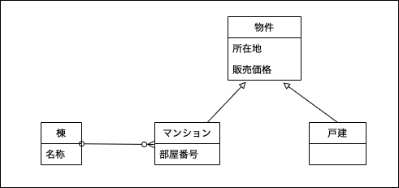
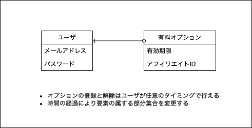
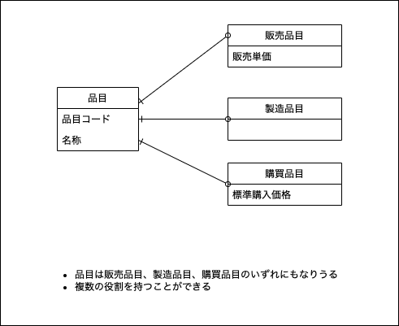

---
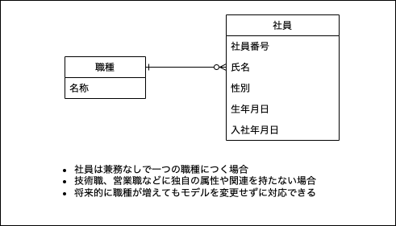

- 種類を表すか具体的なモノを表すのかを区別する場合
- モノから種類への関連の多重度が1 = 要素の帰属する部分集合が唯一

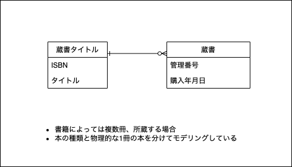

---

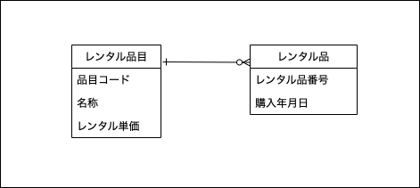
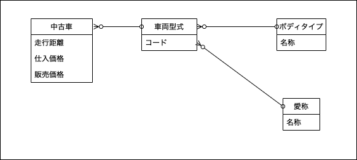

---

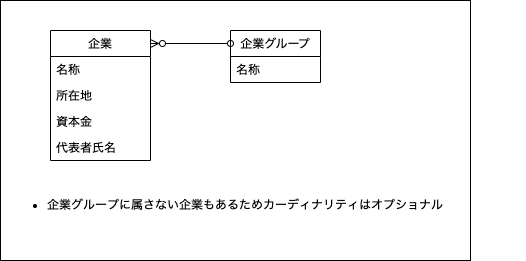

---
- 情報を管理する主体から見た命名をつける
    - 受注は、顧客から注文を受けたという事実をそのまま表現しているため適切な名前

- 1つの商品は複数の受注明細に対応する
- 1つの受注には商品ごとの受注明細が1つ以上存在する

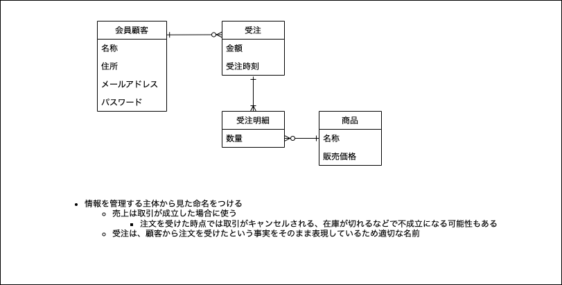

- ビジネスの違いにより管理する対象が変わる
    - 居酒屋チェーンだとその場で代金精算をするため顧客の連絡先は不要

- 命名も異なる
    - 代金の精算時点で取引が完了するため「売上」

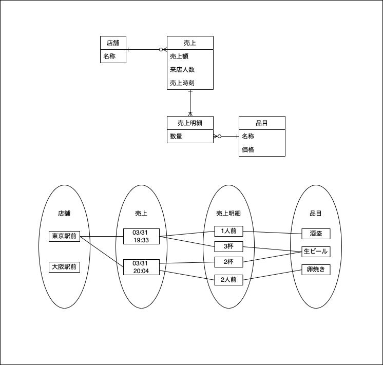

- 多重度(カーディナリティ)の背後にはビジネスルールが隠れている

- 1回の販売に対して、1人の顧客と1人の販売員と1台の中古車が決まる

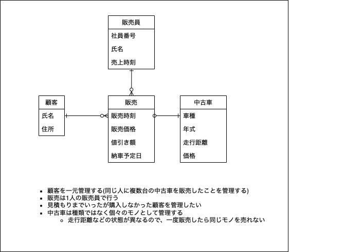

- イベントが在庫を更新する

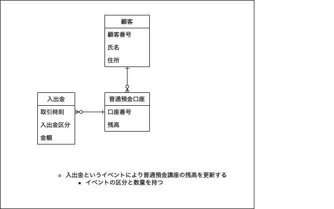

